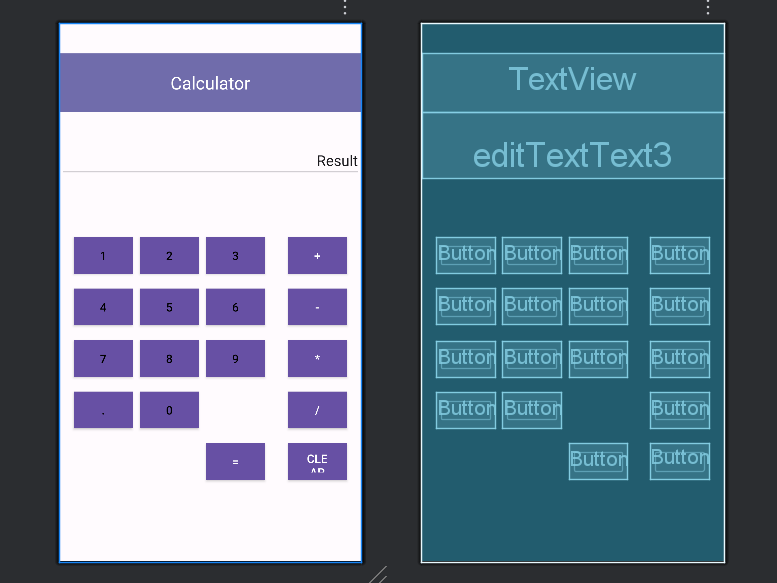
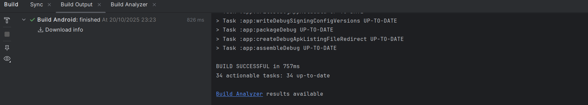

# PROYECTO KOTLIN CALCULADORA

## INTRODUCCIÓN

Se pide crear el diseño/prototipo de una calculadora usando los componentes disponibles en el panel visual de *activity_main.xml* usando como IDE `Android Studio`.

## ERRORES

Aunque el proyecto no muestra signos de errores y el APK se generó correctamente, el emulador de Android Studio no funciona.

## CAPTURAS

Diseño de la calculadora



APK generado



## CONTENIDO XML

1. Activity_main.xml

```xml
<?xml version="1.0" encoding="utf-8"?>
<androidx.constraintlayout.widget.ConstraintLayout xmlns:android="http://schemas.android.com/apk/res/android"
    xmlns:app="http://schemas.android.com/apk/res-auto"
    xmlns:tools="http://schemas.android.com/tools"
    android:id="@+id/main"
    android:layout_width="match_parent"
    android:layout_height="match_parent"
    tools:context=".MainActivity">

    <TextView
        android:id="@+id/textView"
        android:layout_width="409dp"
        android:layout_height="80dp"
        android:layout_marginTop="40dp"
        android:background="#706CAB"
        android:gravity="center"
        android:text="@string/txtTitulo"
        android:textColor="@color/white"
        android:textSize="24sp"
        app:layout_constraintEnd_toEndOf="parent"
        app:layout_constraintHorizontal_bias="0.5"
        app:layout_constraintStart_toStartOf="parent"
        app:layout_constraintTop_toTopOf="parent" />

    <EditText
        android:id="@+id/editTextText3"
        android:layout_width="409dp"
        android:layout_height="90dp"
        android:ems="10"
        android:gravity="bottom|end"
        android:inputType="text"
        android:text="@string/txtResultado"
        android:textSize="20sp"
        app:layout_constraintEnd_toEndOf="parent"
        app:layout_constraintHorizontal_bias="0.5"
        app:layout_constraintStart_toStartOf="parent"
        app:layout_constraintTop_toBottomOf="@+id/textView" />

    <Button
        android:id="@+id/button"
        style="@style/Widget.AppCompat.Button.Colored"
        android:layout_width="80dp"
        android:layout_height="50dp"
        android:layout_marginStart="20dp"
        android:layout_marginTop="80dp"
        android:background="#B8B8B8"
        android:text="@string/btnUno"
        android:textColor="@color/black"
        android:textSize="16sp"
        app:layout_constraintStart_toStartOf="parent"
        app:layout_constraintTop_toBottomOf="@+id/editTextText3" />

    <Button
        android:id="@+id/button4"
        style="@style/Widget.AppCompat.Button.Colored"
        android:layout_width="80dp"
        android:layout_height="50dp"
        android:layout_marginStart="10dp"
        android:background="#B8B8B8"
        android:text="@string/btnDos"
        android:textColor="@color/black"
        android:textSize="16sp"
        app:layout_constraintBottom_toBottomOf="@+id/button"
        app:layout_constraintStart_toEndOf="@+id/button"
        app:layout_constraintTop_toTopOf="@+id/button" />

    <Button
        android:id="@+id/button5"
        style="@style/Widget.AppCompat.Button.Colored"
        android:layout_width="80dp"
        android:layout_height="50dp"
        android:layout_marginStart="10dp"
        android:background="#B8B8B8"
        android:text="@string/btnTres"
        android:textColor="@color/black"
        android:textSize="16sp"
        app:layout_constraintBottom_toBottomOf="@+id/button4"
        app:layout_constraintStart_toEndOf="@+id/button4"
        app:layout_constraintTop_toTopOf="@+id/button" />

    <Button
        android:id="@+id/button14"
        style="@style/Widget.AppCompat.Button.Colored"
        android:layout_width="80dp"
        android:layout_height="50dp"
        android:layout_marginEnd="20dp"
        android:background="#6D6D6D"
        android:text="@string/btnSumar"
        android:textColor="@color/white"
        android:textSize="16sp"
        app:layout_constraintBottom_toBottomOf="@+id/button5"
        app:layout_constraintEnd_toEndOf="parent"
        app:layout_constraintTop_toTopOf="@+id/button5" />

    <Button
        android:id="@+id/button15"
        style="@style/Widget.AppCompat.Button.Colored"
        android:layout_width="80dp"
        android:layout_height="50dp"
        android:background="#6D6D6D"
        android:text="@string/btnRestar"
        android:textColor="@color/white"
        android:textSize="16sp"
        app:layout_constraintBottom_toBottomOf="@+id/button8"
        app:layout_constraintEnd_toEndOf="@+id/button14"
        app:layout_constraintStart_toStartOf="@+id/button14"
        app:layout_constraintTop_toTopOf="@+id/button8" />

    <Button
        android:id="@+id/button16"
        style="@style/Widget.AppCompat.Button.Colored"
        android:layout_width="80dp"
        android:layout_height="50dp"
        android:background="#6D6D6D"
        android:text="@string/btnMultiplicar"
        android:textColor="@color/white"
        android:textSize="16sp"
        app:layout_constraintBottom_toBottomOf="@+id/button11"
        app:layout_constraintEnd_toEndOf="@+id/button15"
        app:layout_constraintHorizontal_bias="0.0"
        app:layout_constraintStart_toStartOf="@+id/button15"
        app:layout_constraintTop_toTopOf="@+id/button11" />

    <Button
        android:id="@+id/button17"
        style="@style/Widget.AppCompat.Button.Colored"
        android:layout_width="80dp"
        android:layout_height="50dp"
        android:background="#6D6D6D"
        android:text="@string/btnDividir"
        android:textColor="@color/white"
        android:textSize="16sp"
        app:layout_constraintBottom_toBottomOf="@+id/button13"
        app:layout_constraintEnd_toEndOf="@+id/button16"
        app:layout_constraintStart_toStartOf="@+id/button16"
        app:layout_constraintTop_toTopOf="@+id/button13" />

    <Button
        android:id="@+id/button18"
        style="@style/Widget.AppCompat.Button.Colored"
        android:layout_width="80dp"
        android:layout_height="50dp"
        android:layout_marginTop="20dp"
        android:background="#2A738C"
        android:text="@string/btnLimpiar"
        android:textColor="@color/white"
        android:textSize="16sp"
        app:layout_constraintEnd_toEndOf="@+id/button17"
        app:layout_constraintStart_toStartOf="@+id/button17"
        app:layout_constraintTop_toBottomOf="@+id/button17" />

    <Button
        android:id="@+id/button19"
        style="@style/Widget.AppCompat.Button.Colored"
        android:layout_width="80dp"
        android:layout_height="50dp"
        android:background="#437121"
        android:text="@string/btnResultado"
        android:textColor="@color/white"
        android:textSize="16sp"
        app:layout_constraintBottom_toBottomOf="@+id/button18"
        app:layout_constraintEnd_toEndOf="@+id/button11"
        app:layout_constraintStart_toStartOf="@+id/button11"
        app:layout_constraintTop_toTopOf="@+id/button18" />

    <Button
        android:id="@+id/button6"
        style="@style/Widget.AppCompat.Button.Colored"
        android:layout_width="80dp"
        android:layout_height="50dp"
        android:layout_marginTop="20dp"
        android:background="#B8B8B8"
        android:text="@string/btnCuatro"
        android:textColor="@color/black"
        android:textSize="16sp"
        app:layout_constraintStart_toStartOf="@+id/button"
        app:layout_constraintTop_toBottomOf="@+id/button" />

    <Button
        android:id="@+id/button7"
        style="@style/Widget.AppCompat.Button.Colored"
        android:layout_width="80dp"
        android:layout_height="50dp"
        android:background="#B8B8B8"
        android:text="@string/btnCinco"
        android:textColor="@color/black"
        android:textSize="16sp"
        app:layout_constraintBottom_toBottomOf="@+id/button6"
        app:layout_constraintStart_toStartOf="@+id/button4"
        app:layout_constraintTop_toTopOf="@+id/button6" />

    <Button
        android:id="@+id/button8"
        style="@style/Widget.AppCompat.Button.Colored"
        android:layout_width="80dp"
        android:layout_height="50dp"
        android:background="#B8B8B8"
        android:text="@string/btnSeis"
        android:textColor="@color/black"
        android:textSize="16sp"
        app:layout_constraintBottom_toBottomOf="@+id/button7"
        app:layout_constraintStart_toStartOf="@+id/button5"
        app:layout_constraintTop_toTopOf="@+id/button7" />

    <Button
        android:id="@+id/button9"
        style="@style/Widget.AppCompat.Button.Colored"
        android:layout_width="80dp"
        android:layout_height="50dp"
        android:layout_marginTop="20dp"
        android:background="#B8B8B8"
        android:text="@string/btnSiete"
        android:textColor="@color/black"
        android:textSize="16sp"
        app:layout_constraintStart_toStartOf="@+id/button6"
        app:layout_constraintTop_toBottomOf="@+id/button6" />

    <Button
        android:id="@+id/button12"
        style="@style/Widget.AppCompat.Button.Colored"
        android:layout_width="80dp"
        android:layout_height="50dp"
        android:layout_marginTop="20dp"
        android:background="#B8B8B8"
        android:text="@string/btnPunto"
        android:textColor="@color/black"
        android:textSize="16sp"
        app:layout_constraintStart_toStartOf="@+id/button9"
        app:layout_constraintTop_toBottomOf="@+id/button9" />

    <Button
        android:id="@+id/button13"
        style="@style/Widget.AppCompat.Button.Colored"
        android:layout_width="80dp"
        android:layout_height="50dp"
        android:background="#B8B8B8"
        android:text="@string/btnCero"
        android:textColor="@color/black"
        android:textSize="16sp"
        app:layout_constraintBottom_toBottomOf="@+id/button12"
        app:layout_constraintStart_toStartOf="@+id/button10"
        app:layout_constraintTop_toTopOf="@+id/button12" />

    <Button
        android:id="@+id/button10"
        style="@style/Widget.AppCompat.Button.Colored"
        android:layout_width="80dp"
        android:layout_height="50dp"
        android:background="#B8B8B8"
        android:text="@string/btnOcho"
        android:textColor="@color/black"
        android:textSize="16sp"
        app:layout_constraintBottom_toBottomOf="@+id/button9"
        app:layout_constraintStart_toStartOf="@+id/button7"
        app:layout_constraintTop_toTopOf="@+id/button9" />

    <Button
        android:id="@+id/button11"
        style="@style/Widget.AppCompat.Button.Colored"
        android:layout_width="80dp"
        android:layout_height="50dp"
        android:background="#B8B8B8"
        android:text="@string/btnNueve"
        android:textColor="@color/black"
        android:textSize="16sp"
        app:layout_constraintBottom_toBottomOf="@+id/button10"
        app:layout_constraintStart_toStartOf="@+id/button8"
        app:layout_constraintTop_toTopOf="@+id/button10" />

</androidx.constraintlayout.widget.ConstraintLayout>
```

2. Strings.xml

```xml
<resources>
    <string name="app_name">Calculadora</string>
    <string name="txtTitulo">Calculator</string>
    <string name="btnUno">1</string>
    <string name="btnDos">2</string>
    <string name="btnTres">3</string>
    <string name="btnCuatro">4</string>
    <string name="btnCinco">5</string>
    <string name="btnSeis">6</string>
    <string name="btnSiete">7</string>
    <string name="btnOcho">8</string>
    <string name="btnNueve">9</string>
    <string name="btnCero">0</string>
    <string name="btnPunto">.</string>
    <string name="btnSumar">+</string>
    <string name="btnRestar">-</string>
    <string name="btnMultiplicar">*</string>
    <string name="btnDividir">/</string>
    <string name="btnResultado">=</string>
    <string name="btnLimpiar">CLEAR</string>
    <string name="txtResultado">Result</string>
</resources>
```

3. Colors.xml

```xml
<?xml version="1.0" encoding="utf-8"?>
<resources>
    <color name="black">#FF000000</color>
    <color name="white">#FFFFFFFF</color>
</resources>
```
